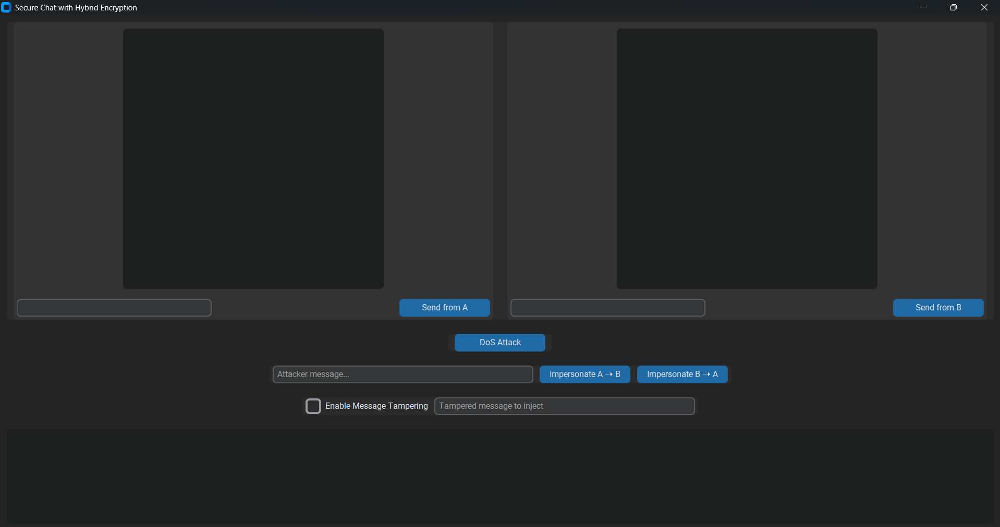

# Secure Two-Party Chat with Hybrid Encryption & Attacker Simulation

This is a Python-based desktop application that simulates secure communication between two users using hybrid encryption (RSA for key exchange, AES for message encryption). It also includes realistic attacker simulations to demonstrate confidentiality, integrity, and availability vulnerabilities.

Built with [`customtkinter`](https://github.com/TomSchimansky/CustomTkinter) for a modern GUI.

# Features
- 🔐 RSA public key exchange + AES symmetric encryption
- 🧑‍🤝‍🧑 Dual chat interface (User A & User B) on the same screen
- 👁️ Eavesdropping log of all communications (plaintext + ciphertext)
- 🧪 Integrity attack (impersonate User A or B)
- 🔁 Tamper mode: Modify live encrypted messages mid-transfer
- 💥 DoS attack simulation: Channel flooding with message logs
- 📋 Real-time chat + attacker activity logging

# Installation
1. Clone the repo

2. Install the dependencies:
   pip install -r requirements.txt

3. Run the app

